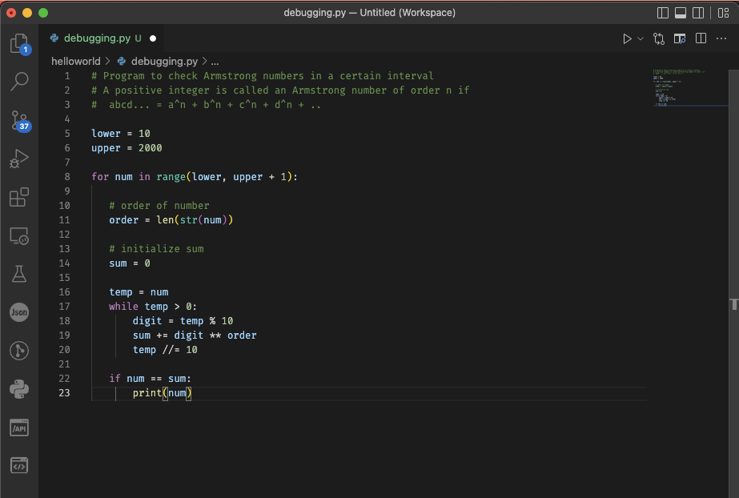
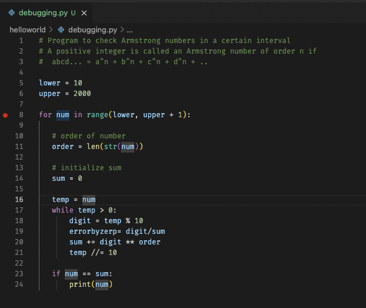
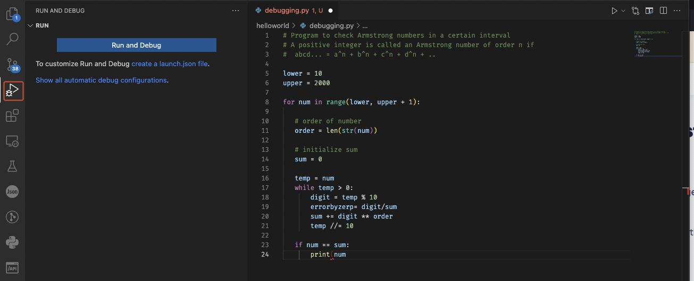
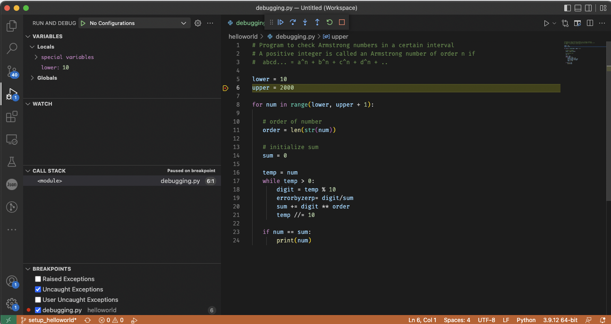
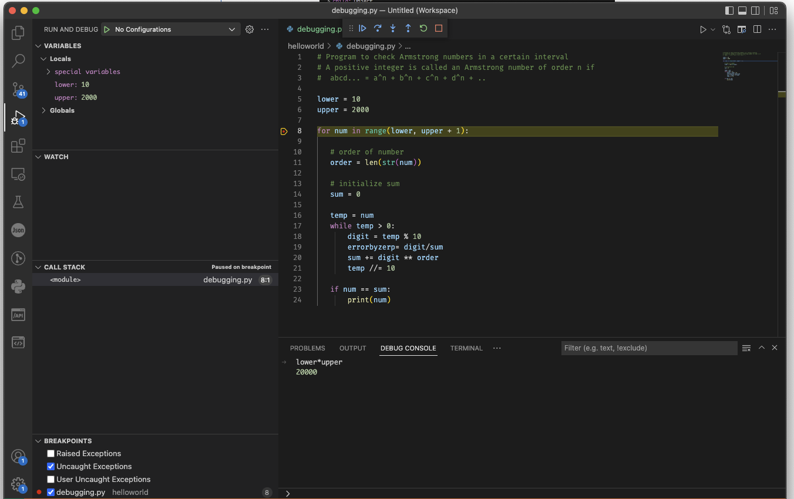

# Debugging in VS Code

## The basics

We are going to use the code below to demonstrate a standard debugging process in Vscode.

```python
# Program to check Armstrong numbers in a certain interval
# A positive integer is called an Armstrong number of order n if
#  abcd... = a^n + b^n + c^n + d^n + ..

lower = 10
upper = 2000

for num in range(lower, upper + 1):

   # order of number
   order = len(str(num))
    
   # initialize sum
   sum = 0

   temp = num
   while temp > 0:
      # digit = temp % 10
       digit = temp / 0

       sum += digit ** order
       temp //= 10

   if num == sum:
       print(num)
```

Open Vscode, create a new file and copyt the code above.




Run it (With the play button on top right).

You should have an error by zero added for the purpose of the debugging.

In this case, this is obvious but we are going to debug step by step. To do so, add a breakpoint by clicking on line 8 :



Press the “play with bug” icon on the left and you  will see the following screen. Press “Run and  Debug”.




After starting debugging, we will see the following screen.




**Variables Pane** — here we can inspect the variables which are created while running the script. We also see the distinction between global and  local variables. 

**Watch Pane** — this pane is a subset of the variables pane. When you have a lot of variables in your program but only you want to check on subset of them, add them in this pane by clicking on the + icon when we hover over the variables pane.  

**Call Stack Pane** — this pane is especially helpful when the code we are debugging has a lot of inner methods. With the help of the call stack pane, we can navigate deep inside a [stack](https://en.wikipedia.org/wiki/Call_stack) and precisely identify from which one the error came from.

**Breakpoints** — in general, **breakpoints** are an important concept while debugging. When we run our script  without specifying any breakpoints, it will stop at the line which causes the error (or execute the entire script if there are no errors). If we want to stop the program earlier and inspect the  state of the variables at that particular point, we can place a breakpoint by clicking to the left of the line number in the editor. The created breakpoint will be indicated by a red dot. When running the script with breakpoints, it will stop at each of them and wait for our further commands. 

On top of our file, we also have the  **debug toolbar**:


It is the main toolbar that allows us to navigate along with the code as we  attempt to debug it. The icons represent the following actions:

- Continue/Pause — pause or continue the debugging process
- Step Over— move over to the next line of code
- Step Into — enter inside a different method during debugging
- Step Out — move to the parent stack
- Restart — restarts the debugging session
- Stop — stops the debugging session


The last pane is the **debug console** where we can work interactively and explore variables. Whenever the debugger hits a breakpoint or an error occurs, in the debug console  we can execute commands at that very step and with the current state of  the variables.




In this example, lower and upper have been multiplied in the debug console.


Play with the debug toolbar (continue and step over), to see how the variables change and to solve the issue.
