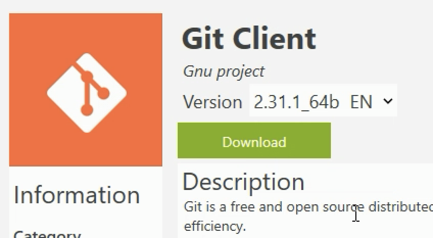
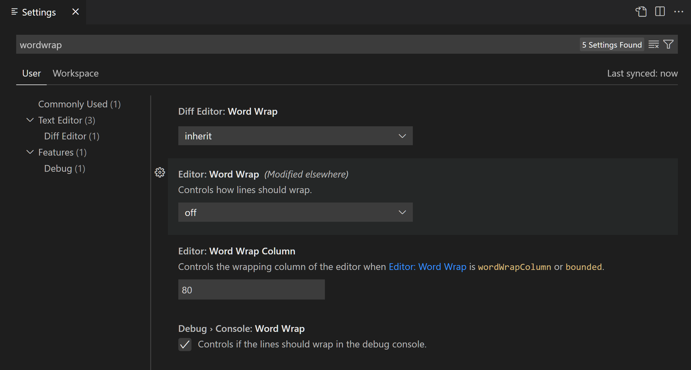
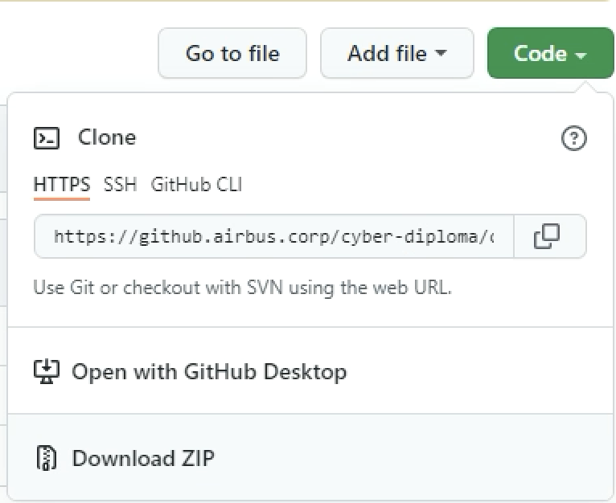

# Module 1: Environment Discovery

## Learning Objectives

- Know the history and ecosystem of Python

- Commenting around python coding environment (tooling)

- Implementing and installating a Coding Environment (IDE Setup)

- Executing a basic python script (Hello World)

  

## Python Tooling Ecosystem

Let’s take a look into the most important features:

- Linting: Get additional code analysis. 
- Code formatting: Format your code 
- Debugging: Debug your Python scripts, web apps, remote or multi-threaded processes
- Testing: Run and debug tests 
- Environments: Automatically activate and switch between virtualenv, venv, pipenv, conda, and pyenv environments
- Refactoring: Restructure your Python code with variable extraction, method extraction, and import sorting

The following sections will deep dive in the usage of each features. Here is the summary of the stack choice:

- Linting: Flake8 and Bandit.
- Code formatting: Black
- Debugging: VSCode
- Testing: Pytest
- Environments: virtualenv
- Refactoring: VSCode (optionnal: isort)

### Linter

A linter is an automated tool that enforces common style guidelines  and best practices.

Linters are not a Python-only thing. They are commonly used in any software development project regardless of the language.

Writing code is a brain-heavy task. There are many things you need to focus on at the same time.

One aspect that gets overlooked constantly is the readability of the  code. When your code finally works it is tempting to ditch it as if you  never had to come back at it again. But this is never the case. You or  one of your teammates will most definitely have to look at that piece of code in the future. As a developer, it is thus your responsibility to  write as readable code as possible.

One of the easiest ways to write cleaner code is by using a **linter** as a code quality assistant.

A linter is a code analyzer that helps you write correctly formatted  code that follows best practices. A linter inspects each line of code  and points out any styling issues it detects.

Commonly a linter finds:

- **Syntax errors**, such as incorrect indentations.
- **Structural issues**, such as unused variables.
- **Best practice violations**, such as too long lines.

Linters are flexible tools. Some linters even make it possible to  auto-fix the styling errors on the fly. This can save you a lot of time.

**Airbus CyberDiploma will use [flake8](https://flake8.pycqa.org/en/latest/) as main linter and [bandit](https://bandit.readthedocs.io/en/latest/) as security code analysis.**

### Formatter

Formatters are similar tools that tries to restructure your code spacing, line length, argument positioning etc to ensure that your code looks consistent across different files or projects.

A formatter is a tool which will format  your code in a way it complies to the tool or any other standard it set.

Reasons for this are:

- You do not need a style guide for low-level problems since the auto formatter deals with those problems
- This directly reduces the number of discussions about unnecessary things and let the developers focus on writing actual code
- It will also help with onboarding developers on the code base because the style of the code is consistent
- Less merge conflicts since the style will almost always be the same

**Airbus CyberDiploma will use [black](https://pypi.org/project/black/) as formatter.**

### Debugging

[Debugging in VSCODE](DEBUGGING.MD)

### Testing in Python

[Testing in Python](TESTING.MD)

**Airbus CyberDiploma will use [pytest](https://pytest.org) as test framework.**

### Virtual Environments

**Airbus CyberDiploma will use  [virtualenv](https://pythonbasics.org/virtualenv/) for virtual environment** 

[Virtual Environment](VENV.md))

### Refactoring

**Airbus CyberDiploma will use native VSCode feature for refactoring.** Isort could be used for import sorting but is out of the scope for Python introduction.


## Python Environment Installation

* Go to https://www.python.org/downloads/, and install it (don't forget to untick install launcher for all users)

  

* Search Git and install it:

  

* Go to https://code.visualstudio.com/Download, Downlaod and install VScode
* Go to https://github.airbus.corp/connectivity/airbus-ca and download the file bundle under the TL;DR section under Documents/airbus-ca.crt

## VisualCode Studio (VSCode) Setup

Visual Studio Code, also commonly referred to as VS Code, is a source-code editor made by Microsoft for Windows, Linux and macOS. Features include support for debugging, syntax highlighting, intelligent code completion, snippets, code refactoring, and embedded Git. Users can change the theme, keyboard shortcuts, preferences, and install extensions that add additional functionality.

In the Stack Overflow 2021 Developer Survey, Visual Studio Code was ranked the most popular developer environment tool, with 70% of 82,000 respondents reporting that they use it.


### VScode Intro Video

Please watch the following videos for an introduction on how to use VScode:

https://code.visualstudio.com/docs/getstarted/introvideos


### VSCode extensions

Airbus Cyberdiploma had made a choice on the extensions to be included in your installation. Please follow the instructions below to install them. You also also have the individuals extensions and a brief description below.

#### Extension Pack Installation in VS Code

**Download and Double click on the [Extension Pack VSIX](airbus-cyberdiploma-0.0.1.vsix) file to install.** 

If the installation fails, install it from within VSCode. Follow the steps to install manually:

- Select **Extensions** (Ctrl + Shift + X)
- Open **“More Action”** menu(ellipsis on the top) and click **“Install from VSIX…”**
- Locate **VSIX** file and select
- Reload VSCode

#### Extensions included

- [**Python extension for Visual Studio Code**](https://marketplace.visualstudio.com/items?itemName=ms-python.python) with rich support for the Python language (for all actively supported versions of the language: >=3.7), including features such as IntelliSense (Pylance), linting, debugging, code navigation, code formatting, refactoring, variable explorer, test explorer, and more!
- **[Python Docstring Generator](https://marketplace.visualstudio.com/items?itemName=njpwerner.autodocstring)** diminishes developers' endeavor by auto-creating docstrings, and though  it may sound trivial, it is a time-saver.
- **[Python Test Explorer](https://marketplace.visualstudio.com/items?itemName=LittleFoxTeam.vscode-python-test-adapter)** extension allows you to run your Python unittest or Pytest tests with the Test Explorer UI. This  small and handy tool will enable you to test your code from VS Code’s  comfort with an excellent user interface and debugging capabilities.
- Code, run and analyze with **[Jupyter Notebooks](https://marketplace.visualstudio.com/items?itemName=ms-toolsai.jupyter)** directly in VS Code, without ever having to leave to your browser. Edit your notebooks with the help of VS Code auto-completion, checks, syntax highlighting, and all you love about VS Code.
- **[Python Snippets](https://marketplace.visualstudio.com/items?itemName=frhtylcn.pythonsnippets)** is an extension full of in-built  snippets packs. This extension is great for  any developer but especially for beginners in Python. It contains  numerous in-built snippets such as string, list, sets, tuple,  dictionary, class, and much more. 
- The **[Better Comments](https://marketplace.visualstudio.com/items?itemName=aaron-bond.better-comments)** extension will help you create more human-friendly comments in your code. With this extension, you will be able to categorise your annotations into: alerts, queries, TODOs, Highlights, etc
- **[GitLens](https://marketplace.visualstudio.com/items?itemName=eamodio.gitlens)** supercharges Git inside VS Code . It helps you to visualize code authorship at a glance via Git blame annotations and CodeLens, seamlessly navigate and explore Git repositories, gain valuable insights via rich visualizations and powerful comparison commands, and so much more.
- **[Visual Studio IntelliCode](https://marketplace.visualstudio.com/items?itemName=VisualStudioExptTeam.vscodeintellicode)** extension provides AI-assisted development features for Python,  TypeScript/JavaScript and Java developers in Visual Studio Code, with  insights based on understanding your code context combined with machine  learning.
- Provides comprehensive **[YAML](https://marketplace.visualstudio.com/items?itemName=redhat.vscode-yaml)** Language support to Visual Studio Code, via the yaml-language-server, with built-in Kubernetes syntax support.
- [**Python Environment Manager**](https://marketplace.visualstudio.com/items?itemName=donjayamanne.python-environment-manager) provides the ability to via and manage all of your Python environments & packages from a single place.
- [**Jinja for Visual Studio Code**](https://marketplace.visualstudio.com/items?itemName=wholroyd.jinja) adds language colorization support for the Jinja template language to VS Code.
- [**Python Preview extension**](https://marketplace.visualstudio.com/items?itemName=dongli.python-preview) with debugging preview support for the Python language.
- [**Visual Studio IntelliCode**](https://marketplace.visualstudio.com/items?itemName=VisualStudioExptTeam.vscodeintellicode) extension provides AI-assisted development features for Python,  TypeScript/JavaScript and Java developers in Visual Studio Code, with  insights based on understanding your code context combined with machine  learning.
- The [**Remote - SSH** extension](https://marketplace.visualstudio.com/items?itemName=ms-vscode-remote.remote-ssh) lets you use any remote  machine with a SSH server as your development environment. This can  greatly simplify development and troubleshooting in a wide variety of  situations.
- **[Markdown All in One](https://marketplace.visualstudio.com/items?itemName=yzhang.markdown-all-in-one)** : All you need for Markdown (keyboard shortcuts, table of contents, auto preview and more).
- [**Presentation Mode**](https://marketplace.visualstudio.com/items?itemName=jspolancor.presentationmode): A simple plugin to show your code properly in a presentation
- **[Partial Diff](https://marketplace.visualstudio.com/items?itemName=ryu1kn.partial-diff):** Compare (diff) text selections within a file, across files, or to the clipboard
- [**Text Power Tools**](https://marketplace.visualstudio.com/items?itemName=qcz.text-power-tools): All-in-one solution with 150+ commands for text manipulation: filter lines (grep), remove lines, insert number sequences and GUIDs, sorting, change case, converting numbers, generating fake data and more. Great for finding information in logs.


## Configuration

### Settings editor UI [#](https://code.visualstudio.com/docs/getstarted/settings#_settings-editor)

To modify user settings, you'll use the Settings editor to review and change VS Code settings.

To open the Settings editor, use the following VS Code menu command:

- On Windows/Linux - **File** > **Preferences** > **Settings**
- On macOS - **Code** > **Preferences** > **Settings**

You can also open the Settings editor from the **Command Palette** (Ctrl+Shift+P on Windows, ⇧⌘P on Mac) with **Preferences: Open Settings**.

When you open the Settings editor, you can search and discover the  settings you are looking for. When you search using the Search bar, it  will not only show and highlight the settings matching your criteria,  but also filter out those which are not matching. This makes finding  settings quick and easy.




### Settings Editor (JSON)

The Settings editor is the UI that lets you review and modify setting values that are stored in a `settings.json` file. You can review and edit this file directly.

* `File -> Preferences -> Settings -> Extensions -> Scroll down` and find `"Edit in settings.json"`

* from the **Command Palette** (⇧⌘P) with **Preferences: Open Settings (JSON)**

* In these paths in your OS

   * Windows %APPDATA%\Code\User\settings.json

   * macOS $HOME/Library/Application Support/Code/User/settings.json

   * Linux $HOME/.config/Code/User/settings.json


🔛 Please use this set of preferences as it allows to configure PIP to use Artifactory and also use the airbus-ca to avoid SSL decryption issues. **Don't forget to replace XXXX with your login**

```
{
    "terminal.integrated.env.windows": {
        "REQUESTS_CA_BUNDLE": "C:/Users/XXXXXX/Documents/airbus-ca.crt",
        "PIP_INDEX_URL": "https://artifactory.2b82.aws.cloud.airbus.corp/artifactory/api/pypi/pypi-airbus-virtual/simple"
    },
    "python.formatting.blackArgs": [
        "--line-length 120"
    ],
    "telemetry.telemetryLevel": "off",
    "editor.formatOnSave": true,
    "editor.formatOnPaste": true,
    "python.formatting.provider": "black",
    "python.linting.banditEnabled": true,
    "python.testing.pytestEnabled": true,
    "python.terminal.activateEnvInCurrentTerminal": true,
    "terminal.integrated.persistentSessionScrollback": 10000,
    "terminal.integrated.scrollback": 10000
}
```


### Install Python modules with Pip

Installing modules to python is easy. Simply open up your terminal:

```
pip install <package name>
```

If there is an EnvironmentError, it means that Python tries by default to install the package into a system path (if Python was installed by an administrator by example). In this case, --user makes pip install packages in your home directory instead, which doesn't require any special privileges.

```
pip install <package name> --user
```

If there is a requirements.txt file, install them with:

```
pip install -r requirements.txt
```

Example of a requirements.txt file with version pinned (for exemple with a `pip freeze > requirements.txt`):

```
numpy==1.21.1
pandas==1.3.1
seaborn==0.11.1
```

Or without version pinned:

```
numpy
pandas
seaborn
```


Tip: Keep up to date with:

```
python -m pip install --upgrade pip
```


## Module "Hello World"

### Download code

* Go to https://github.airbus.corp/cyber-diploma/courses/ and download the code (Download Zip)




* Copy the zip under your Projects folder (here I choose ~/Documents/DevProjects/) and unzip it.

* Add the folder to VScode and trust it (File > Add Folder To Workplace)

  

### Execution

Open the files helloworld-x, execute them and play with them.

* helloworld-1.py: The basic hello world with a simple print
  * Open the file, do `Command Pallette > Python: Run Python file in Terminal` (wait for VSCode to finalize Python extension setup at first run)
  * Observe the terminal


* helloworld-2.py: A basic hellow world including a fonction. We also do a unit test.

  * Open the file, do `Command Pallette > Python: Run Python file in Terminal`
  * Observe the terminal
  * Create a Breakpoint on line 10 by clicking on the red dot

  

  * do `Run > Start debugging` > Python File 

  * Edit the output variable in this way:

    

  * Do a step over with this icon  

  * Observe the terminal. What is the difference ?

  * Go to the Test explorer section. Run the tests, they should be successful for the helloworld2 section.

  

* helloworld-3.py: A more extended hello world using a class to manage more complex uses cases.


  * Do `Command Pallette > Python: Run Python file in Terminal`

  * Demo1 is currently running. Modify the file to make demo2 running.

  * Modify demo3 to allow the helloworld3_test to be running successfully.

  * *Conclusion* : Know which level of complexity is required to use (do you remember the Zen Of Python ?). 

    A simple need is better answered with a simple program. However take in mind how the use case can be expended over time and decide based on that. It is also a good idea to start simple and refactor later if the need arise.


* Helloworld-4.py: a pretty hello world.
  * Do `Command Pallette > Python: Run Python file in Terminal`
  * What is happening ?
  * Install the missing library with `pip install rich`
  * Re-run the python code


