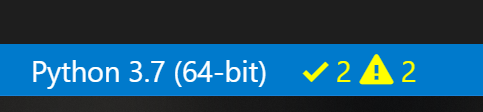

## Testing Your Code

### Automated vs. Manual Testing

Exploratory testing is running your application and checking by yourself. This is a form of manual testing but usually it is cumbersome as you have to reproduce it every time. Furthermore exploratory testing is often done without a plan.

Automated testing is solving this: it's executing your test plan in a reproducible way

### Type of Testing

**Smoke testing**: Very brief initial checks that ensures the basic requirements required to run the project hold. If these fail there is no point proceeding to additional levels of testing until they are fixed.

**Unit testing:** A level of the software testing process where individual units of a software are tested. The purpose is to validate that each unit of the software performs as designed.

**Integration testin**g: A level of software testing where individual units are combined and tested as a group. The purpose of this level of testing is to expose faults in the interaction between integrated units.

**System testing**: A level of the software testing process where a complete, integrated system is tested. The purpose of this test is to evaluate whether the system as a whole gives the correct outputs for given inputs.

**Acceptance testing**: A level of the software testing process where a system is tested for acceptability. The purpose of this test is to evaluate the system’s compliance with the project requirements and assess whether it is acceptable for the purpose.

### Testing in Python

You can write both integration tests and unit tests in Python. To write a unit test for the built-in function `sum()`, you would check the output of `sum()` against a known output. 

For example, here’s how you check that the `sum()` of the numbers `(1, 3, 5)` equals `9`:

```9
>>> assert sum([1, 3, 5]) == 9, "Sum of 1,3,5 is 9"
```

This will not output anything  because the values are correct.

If the result from `sum()` is incorrect, this will fail with an `AssertionError` and the message `"Should be 9"`. Try an assertion statement again with the wrong values to see an `AssertionError`:

```
>>> assert sum([1, 1, 1]) == 9, "Sum of 1,3,5 is 9"
Traceback (most recent call last):
  File "<stdin>", line 1, in <module>
AssertionError: Should be 6
```

You are seeing the raised `AssertionError` because the result of `sum()` does not match `69.

Instead of testing on the REPL, you’ll want to put this into a new Python file called `test_sum.py` and execute it again:

```
def test_sum():
    assert sum([1, 3, 5]) == 9, "Sum of 1,3,5 is 9"

if __name__ == "__main__":
    test_sum()
    print("Everything passed")
```

Now you have written a **test case**, an assertion, and an entry point (the command line). You can now execute this at the command line:

```
$ python test_sum.py
Everything passed
```

You can see the successful result, `Everything passed`.

### Choosing a Test Runner

There are many test runners available for Python. The one built into the Python standard library is called `unittest`. The three most popular test runners are:

- `unittest` (standard library in Python)
- `nose` or `nose2`
- `pytest`

**Airbus CyberDiploma will use pytest as test framework.**


#### `pytest`

[`pytest`](https://realpython.com/pytest-python-testing/) supports execution of `unittest` test cases. The real advantage of `pytest` comes by writing `pytest` test cases. `pytest` test cases are a series of functions in a Python file starting with the name `test_`.

`pytest` has some other great features:

- Support for the built-in `assert` statement instead of using special `self.assert*()` methods
- Support for filtering for test cases
- Ability to rerun from the last failing test
- An ecosystem of hundreds of plugins to extend the functionality

Writing the `TestSum` test case example for `pytest` would look like this:

```
def test_sum():
    assert sum([1, 3, 5]) == 9, "Sum of 1,3,5 is 9"

def test_sum_tuple():
    assert sum((1, 3, 5)) == 9, "Sum of 1,3,5 is 9"
```

You have dropped the `TestCase`, any use of classes, and the command-line entry point.

More information can be found at the [Pytest Documentation Website](https://docs.pytest.org/en/latest/).


## Writing Your First Test

Create the following structure:

```
project/
│
└── my_sum/
    └── __init__.py
```

Open up `my_sum/__init__.py` and create a new function called `sum()`, which takes an iterable (a list, tuple, or set) and adds the values together:

```
def sum(arg):
    total = 0
    for val in arg:
        total += val
    return total
```

This code example creates a variable called `total`, iterates over all the values in `arg`, and adds them to `total`. It then returns the result once the iterable has been exhausted.

### Where to Write the Test

Create a file called `test.py`, which will contain your first test case. Youneed to  be able to import your application to be able to test it hence  place `test.py` above the package folder, so your folder will look like this:

```
project/
│
├── my_sum/
│   └── __init__.py
|
└── test.py
```

As you add more and more tests, your single file  will become cluttered and hard to maintain, so you can create a folder  called `tests/` and split the tests into multiple files. It is convention to ensure each file starts with `test_` so all test runners will assume that Python file contains tests to be  executed. 

**Note:** What if your application is a single script?

You can import any attributes of the script, such as classes, functions, and variables by using the built-in `__import__()` function. Instead of `from my_sum import sum`, you can write the following:

```
target = __import__("my_sum.py")
sum = target.sum
```

The benefit of using `__import__()` is that you don’t have to turn your project folder into a package, and you can specify the  file name. This is also useful if your filename collides with any  standard library packages. For example, `math.py` would collide with the `math` module.

### How to Structure a Simple Test

Before you dive into writing tests, you’ll want to first make a couple of decisions:

1. What do you want to test?
2. Are you writing a unit test or an integration test?

Then the structure of a test should loosely follow this workflow:

1. Create your inputs
2. Execute the code being tested, capturing the output
3. Compare the output with an expected result

For this application, you’re testing `sum()`. There are many behaviors in `sum()` you could check, such as:

- Can it sum a list of whole numbers (integers)?
- Can it sum a tuple or set?
- Can it sum a list of floats?
- What happens when you provide it with a bad value, such as a single integer or a string?
- What happens when one of the values is negative?


### Running Your Tests From Visual Studio Code

If you’re using the Microsoft Visual Studio Code IDE, support for `unittest`, `nose`, and `pytest` execution is built into the Python plugin.

If you have the Python plugin installed, you can set up the configuration of your tests by opening the Command Palette with Ctrl+Shift+P and typing “Python test”. You will see a range of options:

[](https://files.realpython.com/media/vscode-test-capture.dfefa1d20789.PNG)

Choose *Debug All Unit Tests*, and VSCode will then raise a prompt to configure the test framework. Click on the cog to select the test runner (`unittest`) and the home directory (`.`).

Once this is set up, you will see the status of your tests at the  bottom of the window, and you can quickly access the test logs and run  the tests again by clicking on these icons:

[](https://files.realpython.com/media/vscode-test-results.951be75c3d3b.PNG)

This shows the tests are executing, but some of them are failing.