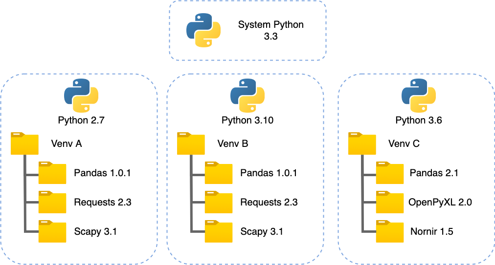
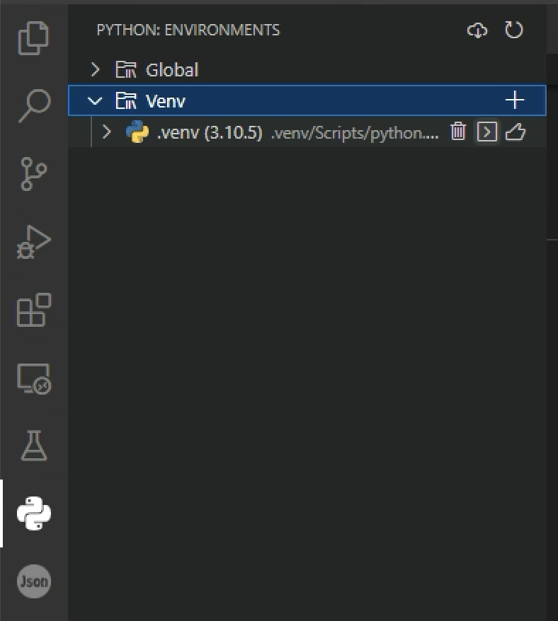

**Airbus CyberDiploma will use  [virtualenv](https://pythonbasics.org/virtualenv/) for virtual environment** 

The interested reader can check the following links to better understand the differents choices: 

* https://dev.to/bowmanjd/python-tools-for-managing-virtual-environments-3bko
* https://aseifert.com/p/python-environments/


#### What is a virtual environment ?

Python by default install modules system wide. That can become an issue if programs need different versions of the same module.

The solution for this problem is to create a [virtual environment](https://docs.python.org/3/glossary.html#term-virtual-environment), a self-contained directory tree that contains a Python installation for a particular version of Python, plus a number of additional packages.





#### Creating Virtual Environments

The module used to create and manage virtual environments is called [`venv`](https://docs.python.org/3/library/venv.html#module-venv).  [`venv`](https://docs.python.org/3/library/venv.html#module-venv) will usually install the most recent version of Python that you have available. If you have multiple versions of Python on your system, you can select a specific Python version by running `python3` or whichever version you want.

To create a virtual environment, decide upon a directory where you want to place it, and run the [`venv`](https://docs.python.org/3/library/venv.html#module-venv) module as a script with the directory path:

```
python3 -m venv tutorial-env
```

This will create the `tutorial-env` directory if it doesn’t exist, and also create directories inside it containing a copy of the Python interpreter and various supporting files.

A common directory location for a virtual environment is `.venv`. This name keeps the directory typically hidden in your shell and thus out of the way while giving it a name that explains why the directory exists. It also prevents clashing with `.env` environment variable definition files that some tooling supports.

Once you’ve created a virtual environment, you may activate it.

On Windows, run:

```
tutorial-env\Scripts\activate.bat
```

On Unix or MacOS, run:

```
source tutorial-env/bin/activate
```

(This script is written for the bash shell.  If you use the **csh** or **fish** shells, there are alternate `activate.csh` and `activate.fish` scripts you should use instead.)

Activating the virtual environment will change your shell’s prompt to show what virtual environment you’re using, and modify the environment so that running `python` will get you that particular version and installation of Python. For example:

```
$ source ~/envs/tutorial-env/bin/activate
(tutorial-env) $ python
Python 3.5.1 (default, May  6 2016, 10:59:36)
  ...
>>> import sys
>>> sys.path
['', '/usr/local/lib/python35.zip', ...,
'~/envs/tutorial-env/lib/python3.5/site-packages']
>>>
```

Installing packets with pip works the same as usual.


#### Tips and tricks on venv

https://code.visualstudio.com/docs/python/environments

To simplify the creation of virtualenv, we are going to create some alias in the powershell profile. Open it with `code $profile` on the powershell terminal. Add the following lines and save.

```
function cvenv {
& python '-m' 'venv' '.venv'
& '.\.venv\Scripts\Activate.ps1'
& pip 'install' '--upgrade' 'pip' 'setuptools'
}

function avenv {
& '.\.venv\Scripts\Activate.ps1'
}

function dvenv {
& deactivate
}
```

Now you can use the command `cvenv` to create a new venv, `dvenv` to deactivate it and `avenv` to activate it.

You can notice if you are in a virtual env by the beginning of the line which should show a green (.venv).

VSCode should recognize by itself the creation of the virtual env and propose to switch your project to it.

You can also find all venv discovered under the tab:



You can either delete it, open a terminal under it or activate it in the current workplace.